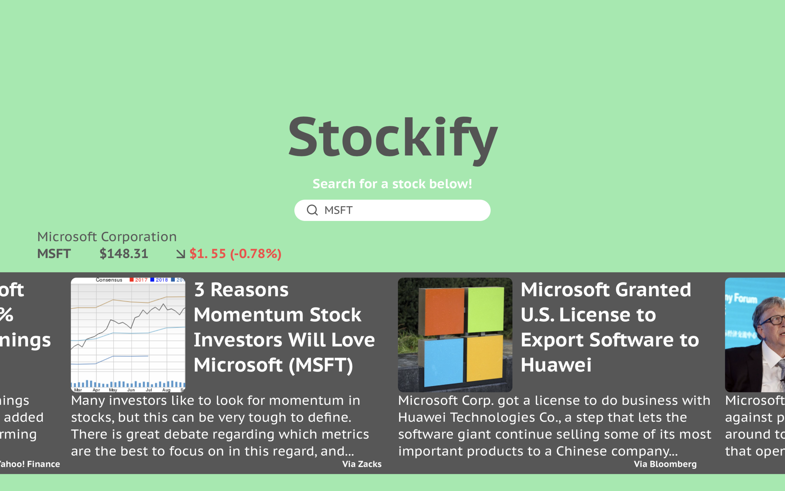

#Stockify
## Description
An easy to use website that tracks Dow components. Allows the user to navigate through financial news about Dow companies and look up quick data and stats. Using a charts and graphs library, users could see historical prices while also reading previous earnings reports from the company.
## Wireframes

## API
Stock News Api: https://stocknewsapi.com
Intrinio: https://intrinio.com
I plan on taking financial news from the Stock News Api while also taking financial data from Intrinio
## Features
#### Search For A Company
Users will be able to search for a company and it will return a feed of companies (Example: searching 'C' will return "Caterpillar Inc, Chevron Corporation, Cisco Systems, The Coca-Cola Company)
#### Present News About Company
After finding the company that the user was searching for, the webpage will load financial news pertaining to the company. Users will be able to scroll through 10 articles.
#### Show Data/Stats About Company
After reading from the financial news, users could look at annual, monthly or weekly charts of the companies prices.
## Stretch Goals
#### Searching For Companies and Showing Results
Previously mentioned, coming up with a way to show companies that the users is searching for (updated in real time)
#### Charts Libraries
I've never actually used a JavaScript Library before. Lucky for me theres a ton of them that all look like they could be helpful. Learning this is a new experience for me.